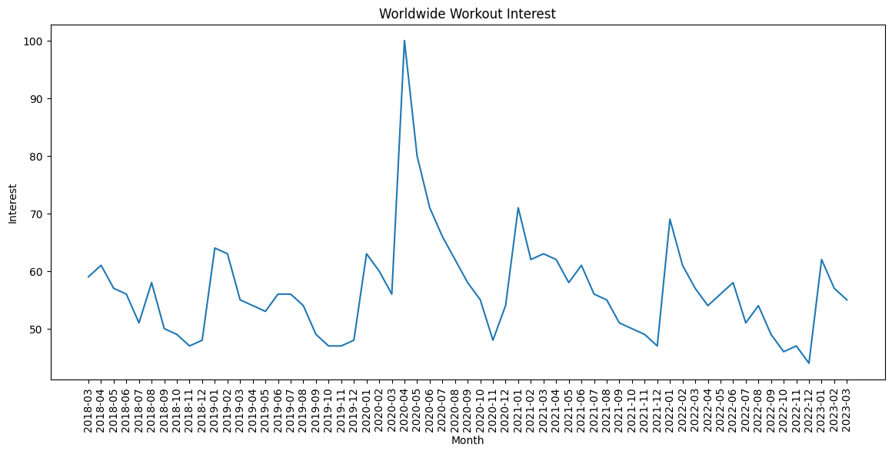
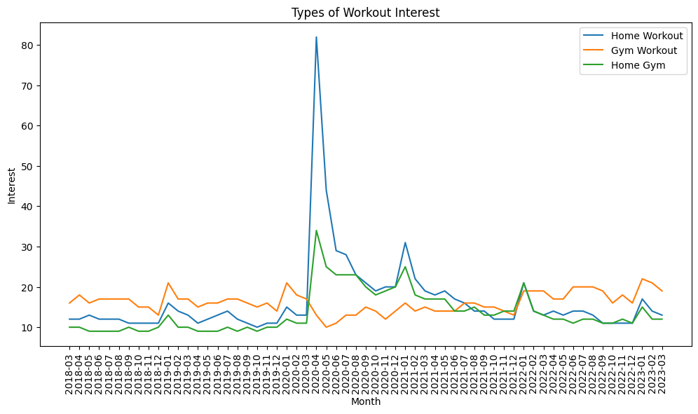
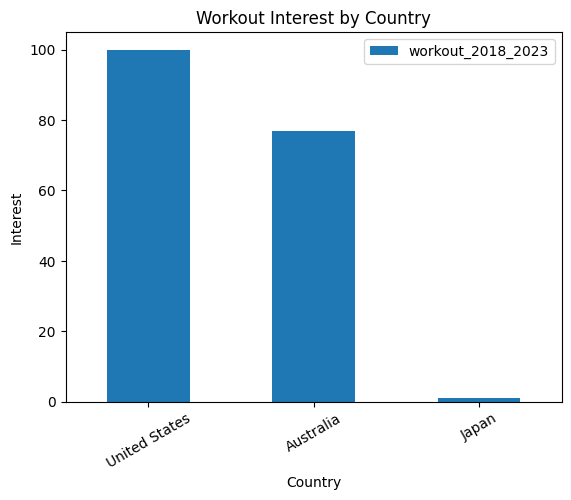

# Workout_market_analysis
Analizyng worldwide trends of workout types.
  
## Repository Structure

The folders and files in this repository are organized as follows:

```
├── data_csv/             # Contains CSV data files for analysis
├── notebook/            # Jupyter notebooks with step-by-step data analysis and visualizations
├── script/              # Python scripts for automated data processing and summary tasks
├── images/               # Generated plots and visualizations exported from notebooks
├── README.md             # Project documentation and instructions
```
## Table of Contents

*   [Project Description](#project-description)
*   [Project Objectives](#project-objectives)
*   [Data](#data)
*   [Analysis and Results](#analysis-and-results)
*   [Key Insights](#key-insights)
*   [How to Run](#how-to-run)
    *   [Prerequisites](#prerequisites)
    *   [Using the Notebook](#using-the-notebook)
    *   [Running the Script](#running-the-script)
*   [Example Usage](#example-usage)
*   [Contributing](#contributing)

## Project description

This project was taken from a learning website calle DataCamp.
Source: https://app.datacamp.com/learn/projects/1684

Aims to analyze global interest trends in physical exercise, with a particular focus on "home workout," "gym workout," and "home gym" equipment purchases. Google Trends data is used to explore how interest has changed over time and across different regions, especially in the context of global events like the COVID-19 pandemic.

The analysis was performed using Python with the Pandas library for data manipulation and Matplotlib for visualization.

## Project Objectives

* Analyze the global trend of interest in "workout" over time.
* Compare interest trends between "home workout," "gym workout," and "home gym."
* Identify the impact of the COVID-19 pandemic on workout trends.
* Compare interest in "workout" among different countries.
* Compare interest in "home workout" between specific countries.

## Data

The data used in this project comes from Google Trends and is divided into four CSV files:

*   `workout.csv`: Contains the global interest in the term "workout" over time.
*   `three_keywords.csv`: Contains the global interest in the terms "home workout," "gym workout," and "home gym" over time.
*   `workout_geo.csv`: Contains the interest in the term "workout" by country.
*   `three_keywords_geo.csv`: Contains the interest in the terms "home workout," "gym workout," and "home gym" by country.


## Analysis and Results

The analysis is presented in the Python notebook and covers the following points:

*   **Global "Workout" Trend**: Visualization of how global interest in "workout" has evolved over time, identifying peaks and valleys.
*   **Workout Type Comparison**: Analysis of interest trends for "home workout," "gym workout," and "home gym," showing how they compare to each other and how they were affected by events like the pandemic.
*   **Geographic Analysis**: Comparison of interest in "workout" among selected countries and a more detailed analysis of "home workout" in specific countries.

Visualizations generated with Matplotlib are included to illustrate key findings.

## Key Insights

Based on the analysis of the Google Trends data, the following key insights were identified:

*   **Peak Interest in 2020:** Worldwide interest in "workout" saw a significant peak in 2020, likely influenced by the global pandemic and lockdowns.



  
*   **Shift to Home Workouts during COVID-19:** During the peak of the pandemic, "home workout" interest surged dramatically, surpassing "gym workout" interest.
*   **Return to Gyms:** Following the initial peak, interest in "gym workout" gradually increased again, while "home workout" interest decreased, suggesting a return to pre-pandemic workout habits for many.
  


*   **Geographic Variations:** Interest in "workout" varies significantly by region, with certain countries showing higher overall interest than other.



*   **Specific Regional Differences:** Within specific workout types, there are differences in interest between countries. This can be seen on the difference of interest on homw workout between Philippines and Malaysia.

## How to Run

To run this project and replicate the analysis, follow these steps:

### Prerequisites

*   **Python:** Make sure you have Python 3.6 or higher installed.
*   **Git:** Install Git to clone the repository.
*   **Libraries:** You will need the `pandas` and `matplotlib` libraries.

### Using the Notebook

You can open and run the analysis step-by-step in a Jupyter environment (like Google Colab, Jupyter Notebook, or JupyterLab).

1.  Ensure you have Jupyter installed (`pip install notebook` or `pip install jupyterlab`).
2.  Navigate to the root directory of the cloned repository in your terminal.
3.  Open the notebook file in your preferred Jupyter environment.
4.  Run the cells sequentially to see the data loading, analysis, and visualizations.

### Running the Script

If you prefer to run the full analysis non-interactively, you can execute the Python script from your terminal.

1.  Navigate to the root directory of the cloned repository in your terminal.
2.  Run the script using the Python interpreter:

## Example Usage

```python
import pandas as pd
import matplotlib.pyplot as plt

df = pd.read_csv('data/workout.csv')
plt.figure(figsize=(14,6))
x= df_workout["month"]
y= df_workout["workout_worldwide"]
plt.plot(x,y)
plt.xticks(rotation = 90)
plt.title("Worldwide Workout Interest")
plt.xlabel("Month")
plt.ylabel("Interest")
plt.show()

```

## Contributing

Contributions are welcome! Please open issues or submit pull requests to suggest improvements.


